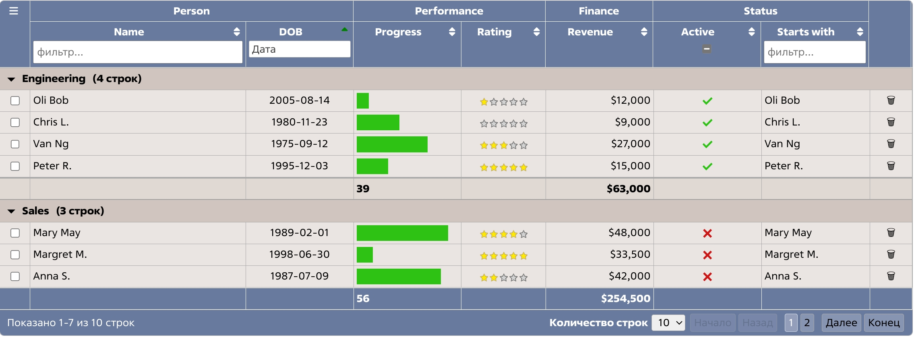

<p align="center">
  
</p>

<p align="center">
	
</p>

<p align="center">
Интерактивная JavaScript-библиотека для создания таблиц
</p>

<p align="center">
Полная документация и демонстрации: <a href="http://tabulator.info">http://tabulator.info</a>
</p>

***
<p align="center">
  
</p>
***

## О проекте

Tabulator позволяет быстро создавать интерактивные таблицы из HTML-таблиц, JavaScript-массивов и JSON-данных.

Библиотека поддерживает сортировку, фильтрацию, группировку, выбор строк, редактирование, пагинацию, расчёты, экспорт и другие возможности.

Этот форк дополнительно адаптирован под рабочие таблицы Cubisio: добавлены безопасные значения по умолчанию, русская локализация и единый визуальный стиль.

## Дополнения этой версии

### Безопасные defaults

- Русский язык (`ru`) используется как локаль по умолчанию.
- Минимальная допустимая ширина столбца — **10px**.
- Для групп по умолчанию переключение выполняется нажатием на весь GroupHeader, а не только на стрелку.
- Добавлен переиспользуемый preset для `rowHeader` с возможностью передавать и переопределять `headerMenu` и добавлять дополнительные обработчики событий.

### Расчёты и выбор строк

Добавлен расчёт `selectedSum`: если строки выбраны, итог считается только по выбранным строкам; если выбор отсутствует — по всем строкам.

Для пересчёта итогов после изменения выбора строк используется автоматический `recalc` при `rowSelected` и `rowDeselected`.

### Работа с данными

Добавлена функция `cubisioData()` для преобразования объекта массивов одинаковой длины в массив объектов, пригодный для передачи непосредственно в `data` Tabulator:

```js
data: cubisioData(data)
```

### Фильтры

Добавлен встроенный header filter `minmax`:

```js
headerFilter: "minmax"
```

Фильтр позволяет выбрать:

- дату «с»;
- дату «по»;
- интервал дат.

В заголовке используется компактное поле, а выбор диапазона открывается во всплывающем окне.

Также сохранён стандартный пользовательский `customHeaderFilter` для сценариев, где требуется собственная логика фильтрации.

### Экспорт

В тестовый пример добавлен и используется модифицированный экспорт, чтобы проверить совместимость экспортируемых данных с остальными доработками таблицы.

### Cubisio-тема

Добавлена и адаптирована тема `tabulator_cubisio.scss`:

- единый фон строк `#eae5e2`;
- одинаковый фон чётных и нечётных строк;
- hover и selected строк `rgb(229, 239, 241)`;
- такой же hover/selected фон для `rowHeader`;
- отдельное оформление GroupHeader с более тёмным фоном и hover;
- чёрные значки сворачивания/разворачивания групп;
- светлые значки сортировки на синем фоне;
- единое оформление `rowHeader`;
- сохранён белый текст footer и границы ячеек;
- стилизованный footer и пагинатор;
- выбранная страница пагинации оформлена без яркого красного цвета;
- минимальная ширина столбцов и безопасные значения по умолчанию приведены к единому стилю.

### Локализация

Добавлена русская локализация, включая пагинацию:

- Первая / Последняя;
- Назад / Вперёд;
- Размер страницы;
- Показано / из / строк;
- сообщения загрузки и ошибки.

Русская локаль используется по умолчанию, но при необходимости может быть переопределена настройкой `locale` конкретной таблицы.

## Поддержка frontend-фреймворков

Tabulator рассчитан на работу с основными frontend-фреймворками, включая React, Angular и Vue.

## Установка

Подключите библиотеку и CSS:

```html
<link href="dist/css/tabulator.min.css" rel="stylesheet">
<script type="text/javascript" src="dist/js/tabulator.min.js"></script>
```

Создайте элемент для таблицы:

```html
<div id="example-table"></div>
```

Инициализируйте Tabulator:

```js
var table = new Tabulator("#example-table", {});
```

### Установка через NPM

```bash
npm install tabulator-tables --save
```

### CDN — UNPKG

```html
<link href="https://unpkg.com/tabulator-tables/dist/css/tabulator.min.css" rel="stylesheet">
<script type="text/javascript" src="https://unpkg.com/tabulator-tables/dist/js/tabulator.min.js"></script>
```

## Сборка

После изменений в исходниках выполните:

```bash
npm run build
```

## Тестирование

В Tabulator есть Unit и End-to-End (E2E) тесты:

```bash
# Unit-тесты
npm run test:unit

# E2E-тесты
npm run build
npx playwright test
# или
npm run test:e2e

# Все тесты
npm run test
```

## Демонстрация

Основной smoke-test и пример добавленных возможностей находится в:

```text
examples/10-full-demo.html
```

В нём собраны демонстрации русской пагинации, группировки, выбора строк, `selectedSum`, `cubisioData`, `minmax`, экспорта и Cubisio-темы.